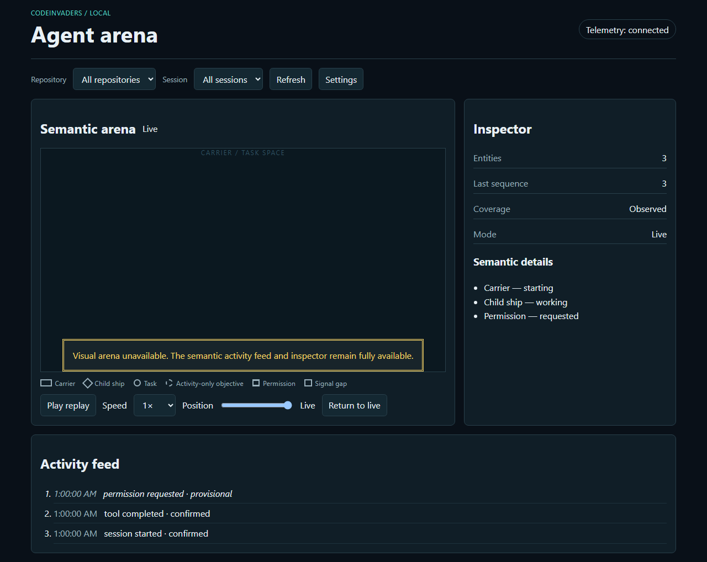

# CodeInvaders

CodeInvaders is a local-first observability project for coding-agent sessions.
It translates supported lifecycle evidence into the vendor-neutral Agent Arcade
Protocol (AAP), a privacy-safe journal, deterministic replay state, and an
accessible browser presentation. It is observational: it does not approve,
deny, rewrite, steer, or remotely control an agent operation.

> **Project status:** this repository is an active `0.1.0` implementation
> foundation. The protocol, journal/reducer, adapter boundaries, local runtime
> security model, fixtures, and release checks are being developed together.
> A stable `v1.0.0` claim requires the installed-product verification described
> in [Compatibility](COMPATIBILITY.md) and [Testing](docs/testing.md).

## Quick start

Requirements: Node.js 24 LTS and pnpm 10.27.x. From a fresh clone:

```text
pnpm install --frozen-lockfile
pnpm check
```

`pnpm check` runs release self-tests, notice, offline endpoint audit,
formatting, lint, type-check, test, production-build, a second offline audit,
and protocol-document checks. The repository is intentionally offline-capable;
the command does not need an agent account, cloud service, or runtime asset
host.

Useful focused commands:

```text
pnpm test
pnpm --filter @codeinvaders/protocol test
pnpm --filter @codeinvaders/core test
pnpm release:test
pnpm release:verify -- --version=0.1.0
```

The local broker and browser shell are exposed from `@codeinvaders/local` for
development and tests. The full installed lifecycle (agent configuration,
runtime process management, and ownership-aware uninstall) is still subject
to the release gates; do not treat a passing fixture test as a claim that every
Codex or Claude Code surface is supported.

## What is recorded

By default, recordings contain allowlisted lifecycle metadata, opaque
installation-local identities, bounded categories, timings, capability state,
and explicit uncertainty. They do **not** persist prompts, messages, hidden
reasoning, source, patches, commands, arguments, tool output, paths, URLs,
credentials, environment variables, transcripts, repository remotes, or user
names. Unknown tool names and labels remain generic unless a documented opt-in
changes that setting. See [Privacy](docs/privacy.md) and the
[Threat model](docs/threat-model.md).

## Supported environments

Source builds target Node.js 24 LTS and pnpm 10 on Windows, macOS, and Linux.
Codex and Claude Code compatibility is version- and capability-profile based:
the adapter can advertise gaps when a host omits a hook, tool, correlation ID,
or denial signal. The exact supported matrix is release-specific and must be
checked against [COMPATIBILITY.md](COMPATIBILITY.md); installed surfaces alone
are not conformance evidence.

## Honest limitations

- A hook checkpoint is evidence, not proof of completion. Quiet, timeout, or
  stop checkpoints never become success automatically.
- Cross-stream ordering is deterministic for display, but does not prove
  global causality when the native host provides no correlation.
- Optional labels are not a semantic redaction system. Keep them disabled for
  sensitive repositories.
- WebGL is a presentation layer. The DOM activity feed and inspector are the
  semantic fallback when WebGL is unavailable or reduced motion is enabled.
- CodeInvaders does not provide cloud collection, LAN dashboards, remote
  control, hidden-reasoning inspection, or an npm publication contract.
- Native agent hooks and host APIs can change. Unsupported or partially
  observed signals must remain visible as capability gaps.

## Visual evidence

The repository includes a real browser capture from the rebuilt local app using
sanitized fixture data:



The capture is evidence for the exercised fixture journey only, not a claim of
complete Codex/Claude coverage or stable-release readiness. The run details,
including browser, viewport, replay, keyboard, privacy, and network checks, are
in [browser verification](docs/release/browser-verification.md).

## Documentation

- [Architecture](docs/architecture.md) — trust boundaries and data flow.
- [Protocol compatibility](docs/protocol-compatibility.md) — AAP events and
  extension rules.
- [Adapter authoring](docs/adapter-authoring.md) — adding a safe adapter.
- [Journal, reducer, and replay](docs/journal-reducer-replay.md) and
  [Replay semantics](docs/replay.md) — canonical state and seeking.
- [Local data layout](docs/data-layout.md) — owned files and recovery.
- [Privacy](docs/privacy.md), [Threat model](docs/threat-model.md), and
  [Accessibility](docs/accessibility.md).
- [Troubleshooting](docs/troubleshooting.md), [Testing](docs/testing.md), and
  [Fixture sanitization](docs/fixture-sanitization.md).
- [Contributing](CONTRIBUTING.md), [Governance](GOVERNANCE.md),
  [Code of Conduct](CODE_OF_CONDUCT.md), and [Security](SECURITY.md).
- [Release scripts](scripts/release/README.md) and
  [branch-protection guidance](docs/release/branch-protection.md).

## License

CodeInvaders is available under the [Apache License 2.0](LICENSE). Third-party
dependency notices are maintained in [THIRD-PARTY-NOTICES.md](THIRD-PARTY-NOTICES.md).
