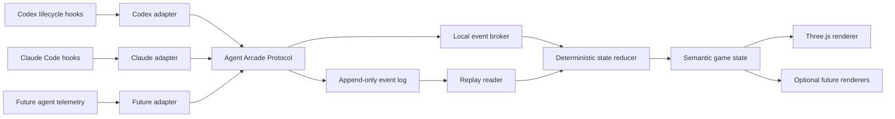

# Agent Arcade: Cross-Agent Coding Visualization Specification

**Status:** Draft v0.1  
**Date:** 2026-08-15  
**Audience:** Maintainers, adapter authors, renderer authors, security reviewers, and early contributors  
**Primary targets:** OpenAI Codex and Anthropic Claude Code  
**Renderer:** Three.js  
**License intent:** Open source; exact license to be selected before public release

## 1. Executive summary

Agent Arcade is a local-first activity monitor that visualizes coding agents as an original retro arcade space battle. It does not attempt to expose or infer a model's hidden reasoning. It projects observable lifecycle events—sessions, agents, tasks, tool calls, failures, and permission requests—into a consistent visual grammar.

The central rule is:

> **Agents are ships. Tools are weapons. Tasks are enemies.**

An orchestrator appears as a carrier or command ship. A subagent appears as a separate fighter launched by its parent. Parallel tool calls made by one agent appear as multiple weapons firing from that agent's ship, not as extra ships. A plan or task list appears as an enemy formation. Completing a task destroys its corresponding enemy; merely invoking tools only animates activity or applies nonterminal damage.

Agent Arcade is cross-agent by design. Codex, Claude Code, and future coding agents feed small adapters that translate native telemetry into a versioned **Agent Arcade Protocol (AAP)**. The game engine and Three.js renderer consume only AAP events and therefore do not depend on any vendor's native event schema.

The first product is an observability tool disguised as an arcade game:

> **Watch your coding agents work.**

## 2. Product goals

### 2.1 Goals

1. Make agent activity, progress, delegation, concurrency, waiting, failure, and replanning understandable at a glance.
2. Support Codex and Claude Code through separate, thin adapters over a shared protocol and state engine.
3. Remain honest about what is observed, inferred, or unavailable.
4. Work when task or subagent telemetry is incomplete, without fabricating events.
5. Support simultaneous sessions across multiple agents and repositories.
6. Store an append-only event log so a live session can be replayed deterministically.
7. Default to local-only processing and privacy-preserving event payloads.
8. Permit future renderers and future agent adapters without changing the core protocol.
9. Keep telemetry hooks fast, advisory, and isolated from the coding agent's critical path.

### 2.2 Product principles

- **Visualization follows the agent.** The agent must not create artificial tasks merely to make the game more interesting.
- **Activity is not progress.** A tool call produces a shot; only an observed task completion destroys the task enemy.
- **Separate actors get separate ships.** Agent concurrency is visible as fleet size.
- **Unknown stays unknown.** Missing telemetry changes the presentation instead of being silently guessed.
- **Local first.** No source code, prompts, tool arguments, or command output leave the machine by default.
- **Protocol before skin.** The alien-invasion theme is the first renderer, not the data model.
- **Deterministic replay.** Given the same ordered event stream and renderer seed, the semantic game state is identical.
- **Noninterference.** A visualization failure must not block, modify, approve, deny, or otherwise steer the coding agent.

## 3. Core metaphor and visual grammar

| Coding-agent concept | Arcade representation | Required semantic rule |
|---|---|---|
| User request / turn objective | Level or boss encounter | One level per turn by default |
| Root/orchestrator agent | Carrier or command ship | Carrier fires only when the root agent itself uses a tool |
| Subagent | Fighter | Launch on spawn; return, dock, or depart on finish |
| Nested subagent | Drone or smaller fighter | Preserve parent-child hierarchy visually |
| Parallel calls by one agent | Multiple weapons on one ship | Never create fake ships for tool concurrency |
| Task / plan item | Enemy | Stable identity across updates |
| Parent task | Large enemy or squad leader | Child tasks form a nearby squad |
| Active task | Diving or highlighted enemy | Assignment and active state are distinct where available |
| Tool | Weapon class | Category selects animation, not semantic outcome |
| Tool call | Shot / scan / drone action | Start and finish are correlated by operation ID |
| Tool success | Hit or positive effect | Does not destroy a task unless task completion is observed |
| Tool failure | Miss, weapon jam, or enemy counterattack | Must not imply the overall task failed |
| Task completion | Enemy destroyed | Terminal and irreversible unless a later correction event reopens it |
| Task failure | Enemy survives and retaliates / becomes damaged red | Distinct from cancellation |
| Task cancellation/removal | Enemy retreats or dissolves | Must not look like successful destruction |
| Permission request | Shield lock / paused incoming projectile | Remains visible until resolved or timed out |
| Replanning | Formation reorders; enemies enter or retreat | Existing task identities should not flicker |
| Agent waiting | Holding pattern | No fake firing |
| Turn completion | Level clear, partial clear, or interrupted | Derived from actual terminal states and end reason |
| Session end | Campaign summary | May occur well after a turn completes |

The renderer may offer alternative skins, but every skin must preserve this semantic distinction between actors, actions, work items, and outcomes.

## 4. System architecture



### 4.1 Components

1. **Native telemetry hooks** receive vendor-specific lifecycle events.
2. **Adapters** validate, sanitize, normalize, correlate, and emit AAP events.
3. **Event writer** appends events to newline-delimited JSON (NDJSON/JSONL) before or independently of live delivery.
4. **Local broker** tails event logs or accepts local IPC and broadcasts events to clients through WebSocket or Server-Sent Events (SSE).
5. **State reducer** converts the ordered event stream into vendor-neutral semantic state.
6. **Presentation mapper** converts semantic state changes into animation intents.
7. **Three.js renderer** renders ships, enemies, shots, effects, labels, and overlays.
8. **Replay controller** reads a recorded stream with play, pause, seek, speed, and filtering controls.

### 4.2 Hard boundaries

- Hooks and adapters must not import Three.js or contain game logic.
- The reducer must not depend on Codex or Claude native payloads.
- The renderer must not parse raw hook events.
- Native transcripts are not a stable API and are not required for the MVP.
- MCP is not the primary telemetry mechanism because it observes only calls the agent chooses to make. MCP may later provide user controls such as opening the UI or changing a theme.

### 4.3 Transport

The canonical durable transport is append-only JSONL. The recommended live path is:

```text
hook stdin → adapter process → atomic JSONL append → local broker → WebSocket → browser UI
```

An adapter must exit successfully after a bounded write attempt. If the broker is unavailable, logging continues. If logging is unavailable, the adapter drops the event after a short timeout and must not block the agent.

## 5. Agent Arcade Protocol

### 5.1 Versioning

- Protocol identifier: `dev.agentarcade.aap`
- Initial version: `0.1.0`
- Version format: Semantic Versioning.
- Major version changes may remove or redefine fields or event semantics.
- Minor versions may add event types, optional fields, or enum values.
- Patch versions clarify behavior without changing valid messages.
- Consumers must ignore unknown optional fields and unknown event types they do not support.
- Every event carries its protocol version so mixed-version logs can be diagnosed.

### 5.2 Event envelope

```ts
type UUID = string;
type ISO8601 = string;

interface ArcadeEvent<TType extends string, TData> {
  spec: "dev.agentarcade.aap";
  version: "0.1.0" | string;
  eventId: UUID;                 // UUIDv7 or ULID; globally unique
  type: TType;
  occurredAt: ISO8601;           // native occurrence time, UTC where available
  observedAt: ISO8601;           // adapter observation time, UTC
  sequence: number;              // monotonic within source.instanceId
  source: {
    adapter: string;             // e.g. "codex", "claude-code"
    adapterVersion: string;
    instanceId: string;          // unique adapter-process or durable source ID
    nativeEvent?: string;        // native event name only, never raw payload
  };
  scope: {
    workspaceId: string;         // privacy-safe stable ID
    repoId?: string;
    sessionId: string;
    turnId?: string;
    agentId?: string;
    taskId?: string;
    operationId?: string;
  };
  links?: {
    correlationId?: string;
    causationEventId?: UUID;
    parentAgentId?: string;
    parentTaskId?: string;
  };
  fidelity: "observed" | "derived" | "synthetic-fallback";
  data: TData;
}
```

**Field rules:**

- IDs are opaque. Consumers must not infer meaning from their format.
- Native IDs should be namespaced and hashed when they may expose sensitive data.
- `occurredAt` may equal `observedAt` when the native source has no timestamp.
- `sequence` establishes source-local order. It does not establish global order across adapters.
- `fidelity: observed` means the native platform directly reported the semantic event.
- `fidelity: derived` means the adapter deterministically derived it from native structured telemetry.
- `fidelity: synthetic-fallback` is reserved for explicit fallback entities such as the single turn boss. It must never masquerade as a real task.
- Event payloads must not contain arbitrary raw native data. A diagnostic mode may store encrypted raw payloads in a separate file with explicit opt-in.

### 5.3 Core event types

#### Protocol and source lifecycle

```ts
type ProtocolEvents =
  | ArcadeEvent<"source.connected", {
      agentKind: string;
      agentVersion?: string;
      hostLabel?: string;
      capabilities: CapabilityProfile;
    }>
  | ArcadeEvent<"source.heartbeat", { uptimeMs: number }>
  | ArcadeEvent<"source.disconnected", {
      reason: "normal" | "timeout" | "error" | "unknown";
    }>
  | ArcadeEvent<"telemetry.gap", {
      fromSequence?: number;
      toSequence?: number;
      reason: "dropped" | "corrupt" | "out-of-order-timeout" | "adapter-restart" | "unknown";
    }>;
```

#### Workspace, session, and turn lifecycle

```ts
type LifecycleEvents =
  | ArcadeEvent<"workspace.discovered", {
      label?: string;             // sanitized display name
      vcs?: "git" | "other" | "none";
    }>
  | ArcadeEvent<"session.started", {
      resume: boolean;
    }>
  | ArcadeEvent<"session.ended", {
      reason: "normal" | "archived" | "deleted" | "idle" | "error" | "unknown";
    }>
  | ArcadeEvent<"turn.started", {
      objectiveLabel?: string;    // opt-in or redacted by default
    }>
  | ArcadeEvent<"turn.finished", {
      outcome: "completed" | "partial" | "failed" | "interrupted" | "unknown";
    }>;
```

#### Agent lifecycle

```ts
type AgentEvents =
  | ArcadeEvent<"agent.spawned", {
      role: "orchestrator" | "worker" | "reviewer" | "researcher" | "tester" | "unknown";
      label?: string;
      depth: number;
    }>
  | ArcadeEvent<"agent.state.changed", {
      from?: "starting" | "working" | "waiting" | "blocked" | "finishing" | "finished" | "failed";
      to: "starting" | "working" | "waiting" | "blocked" | "finishing" | "finished" | "failed";
      reason?: "tool" | "permission" | "delegation" | "native" | "timeout" | "unknown";
    }>
  | ArcadeEvent<"agent.finished", {
      outcome: "completed" | "failed" | "cancelled" | "unknown";
    }>;
```

The root/orchestrator may be emitted as a synthetic agent at `session.started` if the native source has no root-agent lifecycle event. This is a structural fallback, not a claim about internal orchestration.

#### Task lifecycle

```ts
type TaskStatus =
  | "pending"
  | "in_progress"
  | "blocked"
  | "completed"
  | "failed"
  | "cancelled"
  | "unknown";

type TaskEvents =
  | ArcadeEvent<"task.created", {
      label?: string;
      description?: string;
      status: TaskStatus;
      ordinal?: number;
      fallback: boolean;
    }>
  | ArcadeEvent<"task.updated", {
      label?: string;
      description?: string;
      status?: TaskStatus;
      ordinal?: number;
    }>
  | ArcadeEvent<"task.assigned", {
      assigneeAgentId?: string;
    }>
  | ArcadeEvent<"task.completed", {
      completion: "observed" | "derived";
    }>
  | ArcadeEvent<"task.failed", {
      category?: "tool" | "validation" | "agent" | "unknown";
    }>
  | ArcadeEvent<"task.cancelled", {
      reason?: "replanned" | "user" | "superseded" | "unknown";
    }>
  | ArcadeEvent<"task.plan.reconciled", {
      revision: number;
      taskIds: string[];
    }>;
```

`task.plan.reconciled` records the authoritative order of tasks after a snapshot-style plan update. Adapters should also emit the necessary `task.created`, `task.updated`, or `task.cancelled` events before the reconciliation event. This lets a reducer reconstruct state without parsing vendor payloads.

#### Tool lifecycle

```ts
type ToolCategory =
  | "read"
  | "search"
  | "shell"
  | "edit"
  | "test"
  | "build"
  | "browser"
  | "web"
  | "mcp"
  | "agent"
  | "planning"
  | "media"
  | "other";

type ToolEvents =
  | ArcadeEvent<"tool.started", {
      name: string;               // normalized safe name
      category: ToolCategory;
      parallelGroupId?: string;
    }>
  | ArcadeEvent<"tool.completed", {
      name: string;
      category: ToolCategory;
      durationMs?: number;
      resultClass?: "success" | "partial" | "unknown";
    }>
  | ArcadeEvent<"tool.failed", {
      name: string;
      category: ToolCategory;
      durationMs?: number;
      failureClass: "exit_nonzero" | "timeout" | "denied" | "cancelled" | "exception" | "unknown";
    }>;
```

The same `scope.operationId` correlates start and terminal tool events. Command text, file content, output, URLs, query text, and tool arguments are excluded by default.

#### Permission lifecycle

```ts
type PermissionEvents =
  | ArcadeEvent<"permission.requested", {
      category: ToolCategory;
      riskClass?: "read" | "write" | "network" | "execute" | "destructive" | "unknown";
    }>
  | ArcadeEvent<"permission.resolved", {
      outcome: "allowed" | "denied" | "cancelled" | "timed_out" | "unknown";
    }>;
```

If the platform reports the request but not the resolution, the reducer closes it as `unknown` when the associated tool starts, fails, the turn ends, or a configurable timeout expires.

### 5.4 Example event

```json
{
  "spec": "dev.agentarcade.aap",
  "version": "0.1.0",
  "eventId": "0198b772-24d0-7dd0-9f07-2e29af88e940",
  "type": "tool.started",
  "occurredAt": "2026-08-15T14:22:31.120Z",
  "observedAt": "2026-08-15T14:22:31.127Z",
  "sequence": 184,
  "source": {
    "adapter": "codex",
    "adapterVersion": "0.1.0",
    "instanceId": "src_82a1",
    "nativeEvent": "PreToolUse"
  },
  "scope": {
    "workspaceId": "ws_66d0",
    "repoId": "repo_b09e",
    "sessionId": "session_812f",
    "turnId": "turn_47c1",
    "agentId": "agent_root",
    "taskId": "task_a441",
    "operationId": "op_290d"
  },
  "fidelity": "observed",
  "data": {
    "name": "apply_patch",
    "category": "edit"
  }
}
```

### 5.5 Ordering, idempotency, and correlation

- Consumers deduplicate by `eventId`.
- Within a source instance, process by `sequence`.
- The broker may hold out-of-order events for a small window, recommended 250–1000 ms.
- After the window, emit `telemetry.gap` and continue. Live animation must not freeze waiting for a missing event.
- Across sources, sort primarily by `observedAt` for display while preserving source-local order.
- A terminal event without its start creates a short-lived inferred operation with `fidelity: derived` and emits a diagnostic metric, not an error to the user.
- A repeated terminal event is idempotent.
- Reopen of a completed task is allowed only through an explicit `task.updated` with a nonterminal status. The renderer depicts re-entry, not resurrection caused by accidental duplicate data.

## 6. Capability negotiation

Every adapter emits `source.connected` before normal events and whenever its capability profile materially changes.

```ts
type Support = "none" | "derived" | "observed";

interface CapabilityProfile {
  sessions: Support;
  turns: Support;
  tasks: {
    lifecycle: Support;
    snapshotReconciliation: boolean;
    titles: Support;
    descriptions: Support;
    assignment: Support;
    hierarchy: Support;
  };
  agents: {
    lifecycle: Support;
    nesting: Support;
    toolAttribution: Support;
  };
  tools: {
    start: Support;
    success: Support;
    failure: Support;
    duration: Support;
    parallelism: Support;
  };
  permissions: {
    requested: Support;
    resolved: Support;
  };
  repositoryIdentity: Support;
  nativeTimestamps: Support;
}
```

The UI exposes a compact telemetry indicator with three presentation modes:

- **Full formation:** observed task lifecycle and subagent lifecycle.
- **Partial formation:** some entities or outcomes are derived.
- **Activity-only:** one fallback boss, one known root ship, and tool activity.

The profile is descriptive, not aspirational. An adapter must advertise `none` for features that are unavailable in the active platform version, configuration, or session mode.

## 7. Adapter responsibilities

Every adapter must:

1. Parse only documented native hook inputs wherever possible.
2. Validate native input and reject malformed events without crashing the agent.
3. Generate stable privacy-safe workspace, repository, session, agent, task, and operation IDs.
4. Sanitize payloads before persistence.
5. Correlate start/stop pairs and reconcile snapshot-style plans.
6. Emit truthful fidelity and capability information.
7. Append events atomically and tolerate a missing broker.
8. Avoid blocking or changing native agent decisions.
9. Keep a bounded local state cache for deduplication and plan reconciliation.
10. Record adapter diagnostics separately from the AAP event log.

Adapters must not:

- approve or deny permissions;
- modify tool inputs or outputs;
- inject context into the agent;
- parse chain-of-thought or infer hidden reasoning;
- persist raw prompts, source code, command strings, tool output, or transcript contents by default;
- require the agent to invoke an Agent Arcade tool.

### 7.1 Codex adapter

Current Codex lifecycle hooks provide session, tool, permission, subagent, stop, compaction, and session-end surfaces. Tool hooks cover shell commands, unified execution, `apply_patch`, MCP tools, and most local function tools; `update_plan` is observable and `spawn_agent` maps through the Agent tool path. Some hosted tools are not observable through the same tool-hook path, so capability negotiation must reflect actual coverage.

Recommended mapping:

| Codex signal | AAP output | Notes |
|---|---|---|
| `SessionStart` | `source.connected`, `session.started` | Root agent may be structural fallback |
| First turn-scoped event | `turn.started` | If no dedicated turn-start signal is available |
| `PreToolUse(update_plan)` or completed plan call | task diffs + `task.plan.reconciled` | Prefer confirmed input/output path; preserve stable IDs by normalized step identity |
| `SubagentStart` | `agent.spawned` | Use native `agent_id`, type, and parent turn context |
| `SubagentStop` | `agent.finished` | Outcome may be `unknown` unless native data is conclusive |
| `PreToolUse` | `tool.started` | Map native tool name to safe name and category |
| `PostToolUse` | `tool.completed` or derived `tool.failed` | Nonzero shell results are delivered here; classify conservatively |
| `PermissionRequest` | `permission.requested` | Do not influence the decision |
| Later tool event / turn stop | `permission.resolved` | Derived if no direct resolution event is available |
| `Stop` | `turn.finished` | Outcome is `unknown` or `partial` unless task state proves completion |
| `SessionEnd` | `session.ended` | Main session only |
| `PreCompact` / `PostCompact` | optional visual pulse | No semantic task progress |

Plan reconciliation rules:

- Normalize whitespace for matching but retain only a redacted or opt-in label.
- Prefer stable native task IDs if they become available.
- Otherwise match an existing step by exact normalized text, then previous ordinal plus text similarity.
- Never treat a removed task as completed; emit `task.cancelled` with reason `replanned`.
- A status change to `completed` emits `task.completed` once.
- A new step emits `task.created` and flies into formation.

### 7.2 Claude Code adapter

Current Claude Code hooks provide direct tool success and failure signals, permission requests, subagent start/stop with agent attribution, and task creation/completion hooks when Task tools are active. Tool events occurring inside a subagent can carry that subagent's identity. Because Task tools are not present in every session, the adapter must negotiate task support per session.

Recommended mapping:

| Claude Code signal | AAP output | Notes |
|---|---|---|
| `SessionStart` | `source.connected`, `session.started` | Capture capabilities for active version/configuration |
| First prompt/tool event | `turn.started` | Use prompt identifier when available |
| `TaskCreated` | `task.created` | Direct observed event when Task tools are active |
| Task update tool observation | `task.updated`, `task.assigned` | Use documented tool events when available |
| `TaskCompleted` | `task.completed` | Direct observed terminal event |
| `SubagentStart` | `agent.spawned` | Preserve native `agent_id` and `agent_type` |
| `SubagentStop` | `agent.finished` | Keep final message out of the event log by default |
| `PreToolUse` | `tool.started` | Attribute using common `agent_id` fields when present |
| `PostToolUse` | `tool.completed` | Native successful completion |
| `PostToolUseFailure` | `tool.failed` | Native failure; redact error detail |
| `PermissionRequest` | `permission.requested` | Do not return an allow/deny decision |
| Permission denial/success follow-up | `permission.resolved` | Observed where native signal exists, otherwise derived |
| `Stop` / failure event | `turn.finished` | Preserve interrupted/error distinctions where available |

### 7.3 Deduplication between overlapping signals

Native platforms may report both a tool call and a dedicated lifecycle event for the same action. The adapter should emit the semantic event once while still emitting the generic tool activity where useful. For example, a subagent launch may create both:

- `tool.started` for the Agent/spawn tool, producing a launch-control animation; and
- `agent.spawned`, creating the fighter.

The reducer must not create two fighters. Dedicated lifecycle events are authoritative for entity existence; generic tool events are authoritative only for activity.

## 8. Game-state model and reducer

### 8.1 Semantic state

```ts
interface ArcadeState {
  sources: Map<string, SourceState>;
  workspaces: Map<string, WorkspaceState>;
  repos: Map<string, RepoState>;
  sessions: Map<string, SessionState>;
  turns: Map<string, TurnState>;
  agents: Map<string, AgentState>;
  tasks: Map<string, TaskState>;
  operations: Map<string, ToolOperationState>;
  permissions: Map<string, PermissionState>;
  diagnostics: DiagnosticState;
}
```

The reducer is a pure function:

```ts
nextState = reduce(previousState, event)
```

It contains no frame timing, particle effects, audio, random motion, or Three.js objects.

### 8.2 State-to-game mapping

| Semantic transition | Game-state change | Animation intent |
|---|---|---|
| `session.started` | Create arena/campaign lane | Fade in star field and source badge |
| Root agent registered | Create carrier | Carrier enters from bottom |
| `task.created` | Create enemy | Enemy swoops into formation |
| `task.updated` ordinal | Reorder formation | Smooth formation move |
| Task becomes active | Mark target active | Enemy dives or gains targeting ring |
| `task.assigned` | Link agent to task | Targeting line; fighter changes lane |
| `agent.spawned` | Add child ship | Launch from parent ship |
| `tool.started` | Add active operation | Fire category-specific weapon |
| `tool.completed` | Resolve operation | Hit flash, scan completion, or shield tick |
| `tool.failed` | Resolve operation as failed | Jam/miss plus restrained counterattack |
| `permission.requested` | Add blocking state | Shield lock and pulsing approval icon |
| `permission.resolved` | Clear blocking state | Unlock, deny flash, or timeout dissolve |
| `task.completed` | Terminal success | Enemy explosion |
| `task.failed` | Terminal failure | Enemy hardens/red state; no success explosion |
| `task.cancelled` | Remove without success | Enemy retreats or phases out |
| `agent.finished` | Remove active ship | Dock, depart, or damaged retreat based on outcome |
| `turn.finished` | Close level | Clear/partial/interrupted banner based on state |
| `telemetry.gap` | Mark uncertainty | Small signal-loss indicator; no fabricated action |

### 8.3 Tool-to-weapon mapping

| Tool category | Default animation |
|---|---|
| `read` | Narrow scanner beam |
| `search` | Radar sweep |
| `shell` | Cannon shot |
| `edit` | Rapid laser burst |
| `test` | Torpedo and result pulse |
| `build` | Charged beam |
| `browser` | Recon drone |
| `web` | Long-range radar arc |
| `mcp` | Utility drone or portal |
| `agent` | Launch-control flare |
| `planning` | Formation grid pulse |
| `media` | Prism beam |
| `other` | Generic bolt |

Animations must be short, interruptible, and seek-safe. High-frequency tool events are coalesced visually while remaining distinct in the event log.

### 8.4 Task targeting

When the native platform provides assignment, the assigned agent targets that task. Otherwise:

1. Target the task explicitly referenced by event scope.
2. Else target the single active task.
3. Else target the oldest pending task.
4. Else target the fallback boss.

The target selection is a presentation rule and must not be persisted as an observed fact.

## 9. Multi-agent and multi-repository behavior

### 9.1 Multiple agents in one session

- One session has one root carrier unless the source explicitly models multiple peers.
- Each observed subagent is a fighter owned by its parent agent.
- Nested delegation is represented recursively: carrier → fighter → drone/smaller fighter.
- Fleet size equals currently active observed agent concurrency.
- A subagent's tools fire from that subagent when attribution is available.
- Without tool attribution, shots originate from the carrier with an “unattributed” visual treatment; the UI must not guess.

### 9.2 Multiple sessions in one repository

Default layout: separate vertical lanes within one repository arena. A compact mode may stack inactive sessions. Session colors are stable and color-blind-safe. Identical repository IDs are grouped, while task and agent IDs remain session-scoped.

### 9.3 Multiple repositories

Each repository is a sector with its own background marker, task formation, and carrier group. The UI supports:

- overview grid of sectors;
- focus on one repository;
- focus on one session;
- aggregate fleet/concurrency view;
- filters by source (`codex`, `claude-code`, future adapters);
- stable sanitized repository labels when the user opts in.

Repository identity should be derived from a salted hash of the canonical VCS root. The salt is local to the installation. Raw absolute paths are never sent to the UI or stored in the canonical log by default.

### 9.4 Codex and Claude simultaneously

Codex and Claude sessions may be shown side by side in one sector or across sectors. Vendor identity is a small badge or hull accent, not a different semantic grammar. A Codex carrier and a Claude carrier behave identically when their normalized state is identical.

Global ordering is approximate because separate sources have independent clocks. The UI must preserve each source's sequence and avoid implying exact cross-source causality unless linked by explicit correlation IDs.

## 10. Fallback and degraded telemetry behavior

### 10.1 Capability ladder

| Available telemetry | Representation |
|---|---|
| Tasks + subagents + attributed tools | Full fleet and enemy formation |
| Tasks + tools, no subagents | One carrier; multiple enemies |
| Subagents + tools, no tasks | Fleet attacks one fallback boss |
| Tools only | One carrier attacks one fallback boss |
| Session only | Idle carrier and session timer; no fake shots or enemies beyond the fallback objective |
| Temporary telemetry loss | Preserve existing state, show signal loss, reconcile when telemetry returns |

### 10.2 Fallback boss

When no task lifecycle exists, the adapter or reducer creates exactly one `task.created` event with:

```json
{
  "status": "in_progress",
  "fallback": true,
  "label": "Current request"
}
```

The event uses `fidelity: synthetic-fallback`. Tool calls animate attacks but do not deterministically reduce a semantic health percentage. The renderer may show qualitative wear based on activity, clearly as decorative motion. The boss is destroyed only when the turn outcome is observed as completed; for unknown or partial outcomes it remains or retreats.

### 10.3 Missing start or stop signals

- Terminal tool event without start: create and immediately resolve a derived operation.
- Agent stop without spawn: create a minimal derived agent, then finish it without launch animation.
- Session end without turn end: close open operations as unknown and finish the turn as unknown.
- Adapter restart: emit a new `source.connected`; reconstruct from the event log and mark unresolved native operations as unknown after a grace period.

### 10.4 Stale state

The broker expects heartbeats only while an adapter is intended to be persistent. Hook-per-invocation adapters instead record process instance changes and use session events. The UI marks a source stale after a configurable period but does not fail or destroy its tasks.

## 11. Event log and replay architecture

### 11.1 Storage layout

Recommended local layout:

```text
<agent-arcade-data>/
├── config.json
├── identity/
│   └── local-salt
├── events/
│   └── 2026-08-15/
│       ├── source-src_82a1-000001.jsonl
│       └── source-src_f5c0-000001.jsonl
├── indexes/
│   └── sessions.sqlite
├── snapshots/
│   └── session-session_812f-000500.json
└── diagnostics/
    └── adapter.log
```

The canonical event history is JSONL. SQLite is an optional derived index and may be rebuilt. Snapshots accelerate seeking but are never authoritative.

### 11.2 Append guarantees

- One complete UTF-8 JSON object per line.
- Each line ends with `\n`.
- Writers append with an interprocess lock or write to per-source files to avoid line interleaving.
- Partial final lines are ignored and quarantined on recovery.
- Rotation occurs by size or day.
- Retention is configurable; default recommendation is 14 days or 500 MB, whichever is reached first.
- Deletion is explicit and local. No cloud backup is assumed.

### 11.3 Replay

Replay operates on semantic time:

1. Load the latest snapshot at or before the seek point.
2. Reduce subsequent events in deterministic order.
3. Generate animation intents with a seeded pseudo-random generator.
4. Scale inter-event time by playback speed, with configurable idle-gap compression.

Required controls:

- play/pause;
- 0.25×, 0.5×, 1×, 2×, 4×, and “compress idle” speeds;
- timeline scrub;
- jump to task, failure, permission, spawn, or turn boundary;
- filter by repository, session, agent, task, or source;
- inspect sanitized event details;
- return to live edge.

Replay must never reread native transcripts or call an agent. It consumes recorded AAP events only.

### 11.4 Determinism

Semantic state is fully deterministic. Cosmetic particle placement, formation offsets, and camera shake use a seed derived from `sessionId` plus renderer version. Changing a theme may change appearance but not semantic timing or entity identity.

## 12. UI and Three.js renderer

### 12.1 Main views

1. **Live arena:** current activity with minimal labels.
2. **Fleet overview:** all repositories and sessions.
3. **Replay:** timeline and event filters.
4. **Inspector:** selected ship, enemy, operation, or source capabilities.
5. **Settings:** privacy, retention, theme, sound, motion, and display density.

### 12.2 Scene layers

```text
HUD / DOM overlay
  ├── source and telemetry badges
  ├── repository/session selector
  ├── selected-entity inspector
  └── replay controls

Three.js world
  ├── background / sectors
  ├── enemy formations / tasks
  ├── ships / agent hierarchy
  ├── projectiles / tool operations
  ├── permission shields
  └── particles / nonsemantic effects
```

Use the DOM for readable text and interactive controls; use Three.js for the animated world. This avoids blurry text, improves accessibility, and keeps semantic UI navigable without WebGL.

### 12.3 Visual design

- Original retro-futurist art direction; do not copy trademarked game names, sprites, sound effects, layouts, or trade dress.
- Strong silhouette differences between carrier, fighter, drone, enemy, and boss.
- Status must never depend on color alone.
- Vendor accent colors are secondary to status encoding.
- Labels appear on selection or at low entity counts to prevent clutter.
- Long labels are truncated in the arena and available in the inspector.
- Effects are restrained enough that the display remains useful during heavy tool activity.

### 12.4 Performance budgets

MVP targets on a typical development laptop:

- 60 FPS with 100 visible semantic entities and 300 pooled effect objects;
- degrade gracefully to 30 FPS on integrated graphics;
- under 150 MB UI memory for a normal session;
- adapter hook wall time under 25 ms at p95, excluding platform startup overhead;
- live event-to-animation latency under 250 ms at p95 on the same machine;
- no unbounded arrays, particles, DOM nodes, or retained Three.js resources.

Use object pools, instanced meshes for repeated enemies/projectiles, a fixed animation tick, and explicit disposal for geometries, materials, textures, and event listeners.

### 12.5 Accessibility and reduced motion

- Full keyboard navigation for controls and inspector.
- Screen-reader live region summarizing significant semantic events, rate limited.
- Reduced-motion mode replaces travel, shake, and explosions with fades and status changes.
- Mute, volume, and “no audio ever” options; audio off by default for the MVP.
- High-contrast theme and color-blind-safe status palette.
- Text-only activity feed as a first-class fallback when WebGL is unavailable.

### 12.6 Backpressure and event storms

The reducer processes every event. The renderer may coalesce cosmetic activity:

- repeated tool calls by the same agent/category within 100 ms become a burst;
- excess particles are dropped, not semantic events;
- labels and trails reduce at high density;
- the latest semantic state always wins;
- task completion, failure, agent spawn/finish, permission, and telemetry-gap events are never visually dropped.

## 13. Privacy and security

### 13.1 Data minimization defaults

Persist:

- normalized event type and timestamp;
- opaque local IDs;
- safe tool name/category;
- task status and optional sanitized label;
- duration and coarse outcome classes;
- capability and adapter version metadata.

Do not persist by default:

- user prompts;
- assistant messages;
- chain-of-thought or reasoning traces;
- source code or patches;
- file contents or absolute file paths;
- shell commands;
- tool arguments or tool output;
- URLs, search queries, credentials, tokens, environment variables, or transcript contents;
- repository remotes or user names.

Task titles and repository labels are potentially sensitive. Default mode stores opaque labels such as “Task 3” and “Repository B.” Users may opt into sanitized titles per installation or repository.

### 13.2 Local trust boundary

- Bind the broker to loopback only by default.
- Generate a random local session token for WebSocket/SSE clients.
- Reject non-loopback origins unless the user explicitly enables LAN mode.
- Set strict origin checks and Content Security Policy.
- Do not render event strings as HTML.
- Validate all events against the AAP schema and impose size limits.
- Treat adapters and log files as untrusted input to the UI.
- Avoid dynamic code evaluation and remote assets.

### 13.3 Hook safety

Telemetry hooks are observational. They should return no decision payload, no additional context, and no modified tool input/output. They should use short timeouts and fail open from the coding agent's perspective. Installation must show the hook commands and explain what data is recorded.

Codex requires review/trust for non-managed command hooks, including plugin-bundled hooks. Agent Arcade onboarding must treat this as a security feature, not attempt to bypass it. Claude Code installations must likewise leave hook configuration visible and removable.

### 13.4 Filesystem safety

- Store data in the platform-appropriate application data directory, not inside repositories by default.
- Create files with user-only permissions where supported.
- Never follow symlinks when rotating or deleting logs without verifying the resolved target is within the data directory.
- Use bounded retention and provide an explicit “Delete all recordings” action.
- Diagnostic raw-payload capture, if implemented, is off by default, visually prominent, time limited, encrypted at rest, and excluded from bug reports unless the user attaches it.

### 13.5 Network and telemetry policy

MVP has no required external network service and no product analytics by default. Any future crash reporting or usage telemetry is opt-in, documented field by field, and must never include event logs or source-derived labels.

## 14. Package and repository structure

Recommended TypeScript monorepo:

```text
agent-arcade/
├── package.json
├── pnpm-workspace.yaml
├── tsconfig.base.json
├── packages/
│   ├── protocol/                 # AAP types, schemas, fixtures, migrations
│   ├── core/                     # reducer, selectors, snapshots, diagnostics
│   ├── broker/                   # JSONL tailing, WebSocket/SSE, replay API
│   ├── adapter-sdk/              # shared sanitizer, IDs, writer, capability helpers
│   ├── adapter-codex/            # Codex hook normalizer
│   ├── adapter-claude/           # Claude Code hook normalizer
│   ├── renderer-three/           # Three.js scene and animation-intent consumer
│   ├── ui/                       # browser shell, inspector, timeline, settings
│   ├── themes-alien-invasion/    # original assets and theme mappings
│   └── cli/                      # install, doctor, start, replay, uninstall
├── integrations/
│   ├── codex-plugin/
│   │   ├── .codex-plugin/
│   │   │   └── plugin.json
│   │   └── hooks/
│   │       └── hooks.json
│   └── claude-plugin/
│       ├── .claude-plugin/
│       │   └── plugin.json
│       └── hooks/
│           └── hooks.json
├── apps/
│   ├── web/                      # local browser app
│   └── desktop/                  # optional later Tauri shell
├── fixtures/
│   ├── codex/
│   ├── claude/
│   └── aap/
├── tests/
│   ├── conformance/
│   ├── replay/
│   ├── privacy/
│   └── visual/
└── docs/
    ├── protocol.md
    ├── adapter-authoring.md
    ├── privacy.md
    └── architecture-decisions/
```

Publishing may use scoped packages:

```text
@agent-arcade/protocol
@agent-arcade/core
@agent-arcade/broker
@agent-arcade/adapter-sdk
@agent-arcade/adapter-codex
@agent-arcade/adapter-claude
@agent-arcade/renderer-three
@agent-arcade/ui
@agent-arcade/cli
```

The initial monorepo is preferred over separate repositories because protocol, adapters, reducer, and fixtures must evolve together. Packages can split later if release ownership diverges.

## 15. Installation concept

### 15.1 Unified CLI

Target experience:

```bash
npx agent-arcade install
npx agent-arcade start
```

The installer:

1. Detects installed Codex and Claude Code environments.
2. Displays exactly which files and hook commands it proposes to add.
3. Installs only selected adapters.
4. Preserves existing hook configuration and composes rather than overwrites.
5. Runs `agent-arcade doctor` to emit test events and verify the broker/UI.
6. Provides a reversible `agent-arcade uninstall` that removes only entries it owns.

### 15.2 Codex installation

Preferred public path: a Codex plugin bundling its hook configuration and adapter executable. Codex plugin-capable surfaces can discover/install the plugin, while hook-only manual installation remains available where plugins are unavailable. Current Codex documentation indicates plugins are supported in Codex in the ChatGPT desktop app and through the Codex CLI plugin browser, but not in the IDE extension; the installer must probe rather than assume.

After installation, users review and trust the hook definition, start a new session if required by the platform, and run the local Agent Arcade UI.

### 15.3 Claude Code installation

Preferred path: a Claude Code plugin or a reversible hook configuration installed at user or project scope. The installer should default to user scope, display the resulting configuration, and provide a doctor command. Project scope is useful for team opt-in but must never be silently committed.

### 15.4 Process model

MVP uses a local Node.js broker and browser tab. A later optional Tauri shell may provide always-on-top behavior, tray controls, and autostart without changing adapters or protocol.

## 16. Extensibility

### 16.1 Future agent adapters

A future adapter must implement:

- native event ingestion;
- capability profile;
- AAP schema validation;
- safe ID derivation;
- redaction and categorization;
- JSONL writer;
- conformance fixture set;
- degraded-mode behavior.

It need not support tasks, subagents, or permissions. The capability ladder defines truthful fallback behavior.

Potential future adapters include Gemini CLI, Cursor, OpenCode, custom agent SDKs, and CI coding agents. Inclusion is based on observable lifecycle data, not vendor-specific game code.

### 16.2 Future renderers and themes

The reducer emits semantic state and animation intents that can drive other presentations:

- factory floor;
- dungeon party;
- racing pit wall;
- city construction;
- plain operational dashboard;
- terminal/TUI;
- accessibility-first text feed.

Themes may remap models, materials, sounds, and animation styles but cannot redefine AAP semantics.

### 16.3 Extension registration

Minor protocol versions may add namespaced events:

```text
x.<reverse-domain>.<event-name>
```

Extensions must include a documented fallback. Core consumers ignore unknown extension events. Extension fields must not be placed inside core payloads without a protocol revision.

### 16.4 Adapter conformance suite

Each adapter is tested against shared scenarios:

1. session with one fallback boss;
2. plan creation and reorder;
3. task removal versus completion;
4. parallel tools from one agent;
5. subagent launch, attributed tools, and finish;
6. nested subagent;
7. permission request and resolution;
8. tool failure;
9. dropped/out-of-order/duplicate events;
10. adapter restart and log recovery;
11. sensitive strings never reaching canonical AAP logs.

## 17. MVP scope

### 17.1 In scope

- Codex adapter using documented lifecycle hooks.
- Claude Code adapter using documented hooks.
- AAP `0.1.0` schema and runtime validation.
- Capability negotiation.
- JSONL event writer, local broker, and basic replay.
- Pure reducer with deterministic snapshots.
- One original alien-invasion Three.js theme.
- Carrier, fighter, enemy, fallback boss, projectiles, completion explosion, failure feedback, permission pause, and telemetry-gap indicator.
- One repository/session live view, with a basic multi-session selector.
- Task formation from Codex plan reconciliation and Claude task events when available.
- Subagent visualization where available.
- Privacy-safe defaults, retention controls, and local-only networking.
- Browser UI plus text activity feed.
- Install, doctor, start, replay, and uninstall commands.
- Tests for reducer behavior, adapter fixtures, privacy redaction, and replay determinism.

### 17.2 Explicitly deferred

- Native desktop shell and always-on-top mode.
- Audio and music.
- LAN/cloud dashboards.
- Team analytics and historical productivity scoring.
- Mobile companion app.
- Rich multi-repository overview animations.
- Marketplace publication automation.
- Theme marketplace or third-party asset loading.
- Control-plane MCP server.
- AI-generated summaries of sessions.

### 17.3 MVP acceptance criteria

1. The same AAP fixture produces identical semantic state in live and replay modes.
2. One Codex and one Claude session can be visualized without renderer changes.
3. Parallel tool calls from one agent fire multiple weapons from one ship.
4. Spawning two subagents creates two fighters and finishing them removes them correctly.
5. A completed task explodes; a removed/cancelled task retreats.
6. A session without task telemetry shows one explicitly synthetic fallback boss.
7. No default canonical log contains prompt text, source code, absolute paths, command text, or tool output.
8. Killing the broker or closing the UI does not prevent the coding agent from continuing.
9. Duplicate and out-of-order events do not duplicate entities or corrupt terminal state.
10. The UI remains usable with 100 entities and a sustained burst of tool events.

## 18. Non-goals

Agent Arcade is not:

- a debugger for hidden model reasoning;
- a claim that tool volume equals productivity;
- a benchmark or leaderboard for comparing humans, agents, vendors, or repositories;
- a replacement for terminal logs, tests, traces, or code review;
- a permission broker or security enforcement tool;
- an agent orchestrator;
- a system that changes an agent's plan to improve visuals;
- a faithful clone of Galaxian, Space Invaders, or any other commercial game;
- a cloud surveillance product;
- a guarantee that every native agent event is observable.

## 19. Implementation roadmap

### Phase 0 — protocol spike (1 week)

- Record representative sanitized native hook fixtures from Codex and Claude Code.
- Confirm stable identifiers, tool correlation, failure detection, and task availability.
- Write AAP schema, JSON Schema artifacts, and ten golden event streams.
- Decide ID hashing, local data path, and retention defaults.
- Exit criterion: both adapters can normalize fixtures into valid AAP without a renderer.

### Phase 1 — core and replay skeleton (1–2 weeks)

- Implement JSONL writer, rotation, recovery, and broker.
- Implement reducer, selectors, snapshots, and deterministic event ordering.
- Build a plain text live feed and replay CLI.
- Add duplicate, gap, restart, and out-of-order tests.
- Exit criterion: live and replay end in byte-equivalent serialized semantic state.

### Phase 2 — Codex adapter (1 week)

- Package hooks for session, tool, permission, subagent, stop, and session end.
- Implement `update_plan` reconciliation.
- Implement conservative shell/tool failure classification.
- Build plugin and manual hook installation paths.
- Exit criterion: a real Codex session produces tasks, tool shots, subagents, and a correct terminal state without storing sensitive payloads.

### Phase 3 — Claude Code adapter (1 week)

- Map direct tool success/failure, permission, subagent, and task hooks.
- Detect sessions where Task tools are absent and negotiate degraded mode.
- Attribute subagent tool calls when native IDs are present.
- Package plugin/manual installation and uninstall.
- Exit criterion: the same UI runs Codex and Claude sessions side by side.

### Phase 4 — Three.js MVP (2–3 weeks)

- Implement arena, carrier, fighters, enemies, fallback boss, weapons, and terminal animations.
- Add animation-intent queue, object pools, density reduction, and seek-safe replay.
- Add DOM HUD, inspector, source capability badge, reduced motion, and text fallback.
- Exit criterion: all MVP semantic transitions are visually distinct and performance targets pass.

### Phase 5 — installation and hardening (1–2 weeks)

- Implement unified installer, doctor, start, replay, and uninstall.
- Conduct redaction tests, malicious-event tests, origin/CSP review, and filesystem safety review.
- Test Windows, macOS, and Linux paths and process behavior.
- Write contributor and adapter-authoring documentation.
- Exit criterion: a new user can install, verify, watch, replay, and fully uninstall both adapters.

### Phase 6 — public alpha

- Publish protocol and core packages.
- Release signed/checksummed artifacts where applicable.
- Gather feedback on semantic clarity, not just visual delight.
- Measure dropped events, adapter latency, renderer latency, and fallback frequency locally.
- Freeze AAP `0.1.x`; promote to `1.0.0` only after at least one future-agent adapter proves the abstraction.

## 20. Key risks and mitigations

| Risk | Mitigation |
|---|---|
| Native hook schemas change | Runtime capability negotiation, adapter versioning, fixtures, official-doc checks, graceful degradation |
| Task semantics differ across agents | Normalize lifecycle, not vendor vocabulary; preserve `fidelity`; use fallback boss |
| Tool activity is mistaken for progress | Only task/turn terminal events destroy enemies |
| Hooks slow or disrupt coding agents | Tiny bounded adapters, local append, fail-open behavior, broker independence |
| Sensitive data enters logs | Allowlist fields, redact before persistence, privacy tests, raw capture off |
| Event storms overwhelm UI | Process all semantic events, coalesce effects, object pools, backpressure |
| Cross-source clocks disagree | Preserve source sequence; show global ordering as approximate |
| Visuals become legally derivative | Original name, art, sound, layout, and theme assets |
| Adapter guesses wrong outcome | Conservative `unknown`, explicit fidelity, no fabricated completion |
| Multi-agent view becomes unreadable | Focus modes, grouping, density reduction, inspector, text feed |

## 21. Open decisions

1. Whether `task.updated` should remain patch-shaped or use a full task snapshot in AAP 1.0.
2. Whether the broker should prefer WebSocket alone or expose both WebSocket and SSE.
3. Whether SQLite indexing belongs in MVP or follows after JSONL replay proves sufficient.
4. How much task-title redaction can be automatic without producing misleading labels.
5. Whether root agents should always receive explicit `agent.spawned` events or be implicit in `session.started` in AAP 1.0.
6. Whether a desktop shell is valuable enough to prioritize immediately after the browser MVP.
7. Which protocol governance model and license best support third-party adapters and themes.

## 22. Reference notes

This specification intentionally relies on capability negotiation because coding-agent telemetry changes over time. As of 2026-08-15:

- OpenAI's Codex hook documentation lists lifecycle events including `SessionStart`, `PreToolUse`, `PermissionRequest`, `PostToolUse`, `SubagentStart`, `SubagentStop`, `Stop`, and `SessionEnd`; it also documents local function-tool coverage including `update_plan` and the Agent path for `spawn_agent`: [OpenAI Codex hooks](https://developers.openai.com/codex/hooks).
- OpenAI's plugin documentation describes plugin availability across supported Codex surfaces and notes that the IDE extension does not support plugins: [OpenAI Codex plugins](https://developers.openai.com/codex/plugins).
- Anthropic's Claude Code hook reference documents tool lifecycle hooks, `PostToolUseFailure`, permission hooks, subagent IDs and types, and task creation/completion hooks, while noting that task events do not fire in sessions without Task tools: [Claude Code hooks reference](https://docs.anthropic.com/en/docs/claude-code/hooks).
- Anthropic's hook guide describes configuring and testing Claude Code hooks: [Claude Code hooks guide](https://docs.anthropic.com/en/docs/claude-code/hooks-guide).

These references inform the initial adapters but are not part of the AAP contract. Adapter implementations must test the active environment and advertise what they actually observe.

---

**One-sentence product definition:** Agent Arcade is a local-first, cross-agent observability layer that turns real coding-agent lifecycle telemetry into a truthful, replayable arcade visualization.
