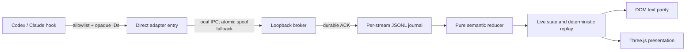

# Architecture

CodeInvaders is a local observability pipeline. Native hooks are evidence, not
commands, and every boundary is intentionally one-way.

`packages/protocol` owns the Agent Arcade Protocol (AAP), validation, and
canonical serialization. `packages/adapter-sdk` owns sanitization, opaque local
identity, transport, and diagnostics. The Codex and Claude packages translate
only native evidence they actually observe. `packages/core` owns journals,
snapshots, replay, and semantic state. `apps/local` owns the loopback broker,
authenticated browser API, presentation mapper, DOM UI, and renderer.
`packages/cli` owns installation and process lifecycle.

The journal is authoritative. Manifests, indexes, snapshots, and rendered state
are derived and may be rebuilt. Three.js objects never become application
state. Hook processes never read browser state and the browser port never
accepts hook ingress.

## Evidence and finality

`fidelity` says whether evidence was observed, derived, or synthetic.
`finality` says whether it is provisional or confirmed. Pre-tool, permission,
task-request, stop, and subagent checkpoints can be blocked, rewritten,
repeated, or omitted, so the reducer models requested, active, quiescent, and
sealed states separately. A timeout or quiet period never becomes success.

## Failure model

Adapters fail open for the coding agent. A broker outage attempts a bounded
atomic spool write; spool exhaustion creates an explicit telemetry gap. Invalid
native or canonical data yields a bounded diagnostic without copied input.
Partial journal suffixes are discarded while complete prefixes survive.
Unsupported snapshots rebuild from journals.
